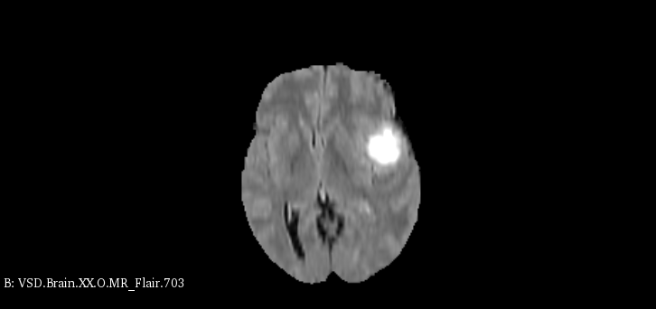

### Denoising of BRAIN MRI
---

Image denoising's underlying goal is to estimate the original image by suppressing noise from a noise-contaminated version of the image. Image noise may be caused by different intrinsic (i.e., sensor) and extrinsic (i.e., environment) conditions which are often not possible to avoid in practical situations. 

We want to reduce noise in Brain MRI images which usually contain Gaussian, Rician, Rayleigh noises.
and we intend to do it using AutoEncoders.


#### Setup

```
conda create -n denoise python=3.9
conda activate denoise
conda install --file requirements.txt
pip3 install medpy nibabel
```
